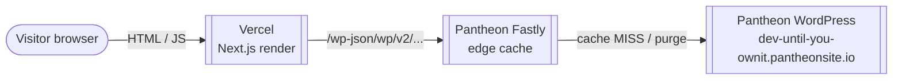

# Architecture

This project is a **headless WordPress + Next.js** stack split across two managed services:

| Layer | Code repository | Hosting |
| --- | --- | --- |
| Frontend (Next.js App Router) | [`teamcornett/WP-Headless`](https://github.com/teamcornett/WP-Headless) | Vercel |
| Backend (WordPress) | Pantheon Git (`until-you-ownit`) | Pantheon (Dev / Test / Live) |

## Request flow



1. A visitor requests a page from the Vercel-hosted Next.js app.
2. Each page component is a **server component** that calls `getPageBySlug` / `getRecentPosts` in [`src/lib/wordpress.ts`](../src/lib/wordpress.ts).
3. Those helpers `fetch()` the WordPress REST API at `${NEXT_PUBLIC_WORDPRESS_URL}/wp-json/wp/v2/...` with `next: { revalidate: 60 }`.
4. The request hits Pantheon's Fastly edge first. On HIT it returns instantly. On MISS, Fastly asks the WordPress origin and caches the response.
5. Vercel renders the HTML and returns it to the visitor. Subsequent visitors hit Vercel's own cache for up to 60 seconds, then Vercel re-fetches from Pantheon.

## What lives where

### Frontend repo (this repo)

```
src/
  app/
    layout.tsx          # Site shell, fonts, header/footer
    page.tsx            # Homepage, renders WP posts
    [slug]/page.tsx     # Catch-all dynamic WP pages
    about/page.tsx       # WP page slug "about"
    be-counted/page.tsx  # WP page slug "be-counted"
    owners/page.tsx      # WP page slug "owners"
    podcast/page.tsx     # WP page slug "podcast"
    events/page.tsx      # WP page slug "events"
    services/page.tsx    # WP page slug "services"
    contact/page.tsx     # WP page slug "contact"
    globals.scss        # Tailwind layers + global styles
  lib/
    wordpress.ts        # WP REST helpers + types + mock fallback

public/                 # Static assets (logos, svgs, favicons)
docs/                   # Documentation (this folder)
.env.example            # Template for required env vars
docker-compose.wordpress.yml  # Optional offline WordPress
```

### Backend repo (cloned separately)

```
~/Documents/until-you-ownit/   # Pantheon Git checkout
  index.php                    # WP entry
  wp-config*.php
  wp-content/
    plugins/                   # Plugins (managed via git on Pantheon)
    themes/                    # Themes (managed via git on Pantheon)
    mu-plugins/                # Pantheon-required must-use plugins
  pantheon.yml                 # Pantheon site config (PHP version, etc.)
```

Pantheon ships a default WordPress upstream; we add custom plugins/themes through `wp-content/`. Database content (pages, posts, settings) is **not** in git — it lives in each Pantheon environment's MySQL DB.

## Where data lives

| Item | Stored in |
| --- | --- |
| WordPress code (themes, plugins, mu-plugins) | Pantheon git repo (`master`) |
| WordPress content (pages, posts, options) | Pantheon environment database (Dev/Test/Live each have their own) |
| Uploaded media | Pantheon environment files (separate per env) |
| Frontend code | `teamcornett/WP-Headless` GitHub `main` |
| Frontend env vars | Vercel project settings (Production / Preview / Development scopes) |
| Local dev env vars | `.env.local` (gitignored) |

## GitHub repo

Vercel watches **`teamcornett/WP-Headless`**. Pushes to `origin` trigger Preview (any branch) and Production (`main`) builds.

```bash
$ git remote -v
origin  https://github.com/teamcornett/WP-Headless.git (fetch / push)
```

If your local clone still points at the old personal repo (`therealboone/WP-Headless`), repoint `origin`:

```bash
git remote set-url origin https://github.com/teamcornett/WP-Headless.git
git remote remove teamcornett 2>/dev/null || true
```

## Caching layers (top to bottom)

1. **Browser cache** — short, set by Vercel.
2. **Vercel CDN** — caches rendered HTML and static assets globally.
3. **Next.js fetch data cache** — `next: { revalidate: 60 }` keeps WP REST responses for 60 seconds per URL.
4. **Pantheon Fastly edge** — global Varnish layer in front of WordPress. Auto-purges via the **Pantheon Advanced Page Cache** plugin when content changes.
5. **WordPress object cache / page cache** — Pantheon-managed, mostly transparent.

See [caching.md](./caching.md) for the full invalidation story.

## Custom domain mapping (later)

When you launch a custom domain (e.g. `untilyouownit.com`):

- Map the apex/www to the Vercel project (Vercel → **Settings → Domains**).
- Vercel Production should use the **Pantheon Live** REST URL (or the Live custom domain, if Live's WP is reachable on its own domain).
- Pantheon Live's WP-Admin is still reached at `live-until-you-ownit.pantheonsite.io/wp-admin`.

## See also

- [getting-started.md](./getting-started.md) — set up your local dev environment from zero
- [wordpress-pantheon.md](./wordpress-pantheon.md) — Pantheon backend operations
- [deployment.md](./deployment.md) — deploy runbook for Vercel + Pantheon
- [caching.md](./caching.md) — caching and invalidation
- [troubleshooting.md](./troubleshooting.md) — common issues and fixes
